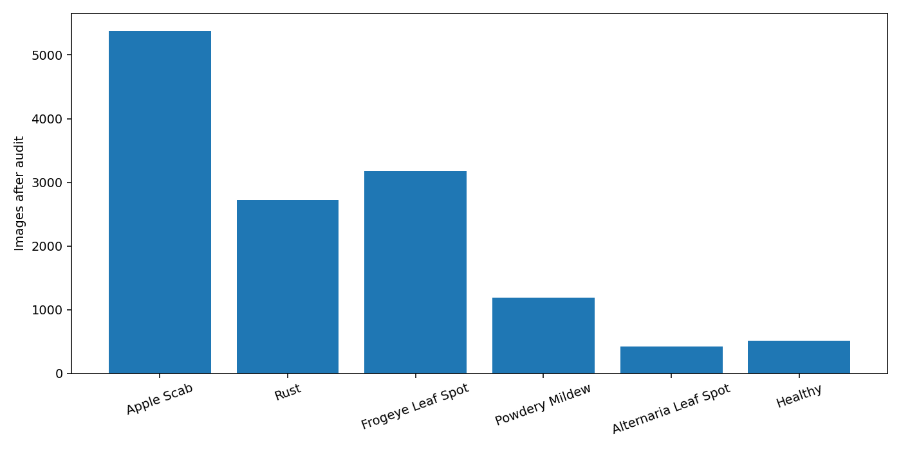
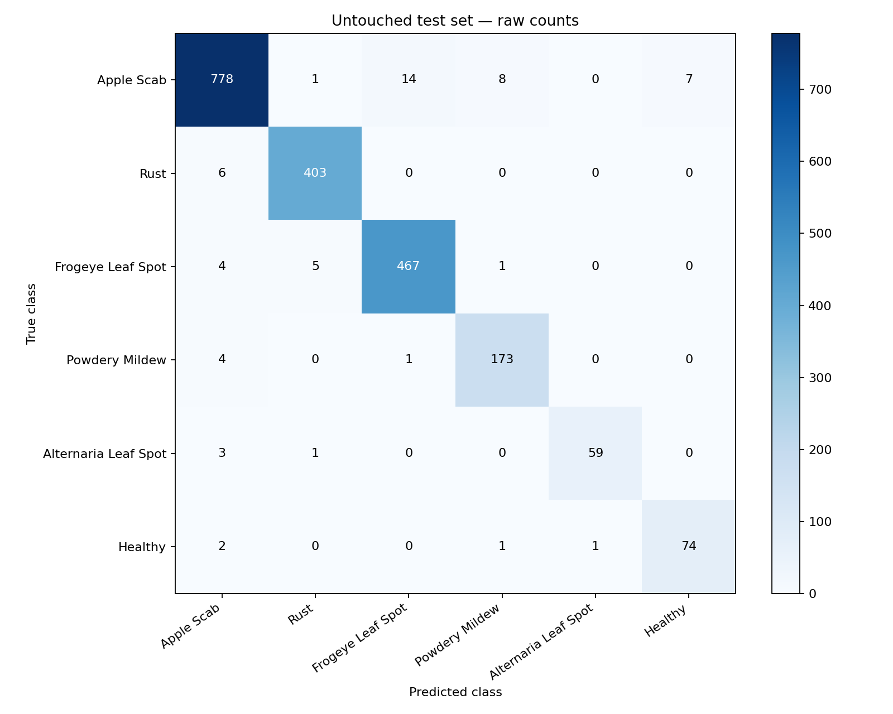
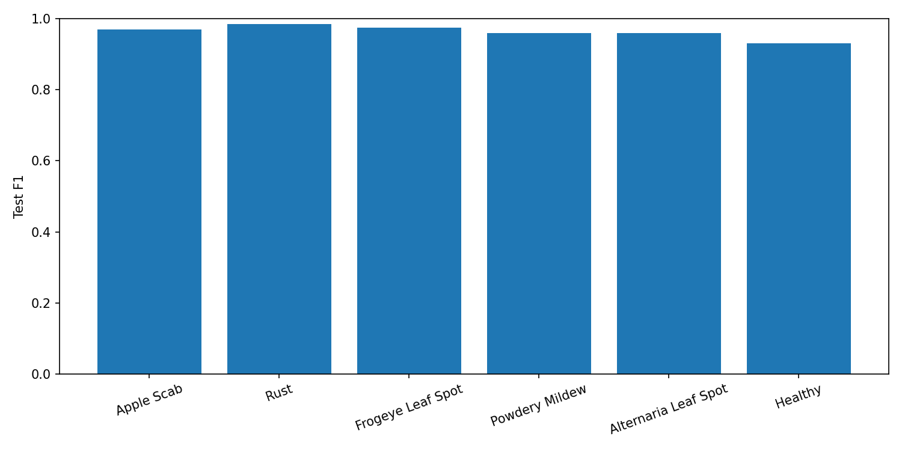
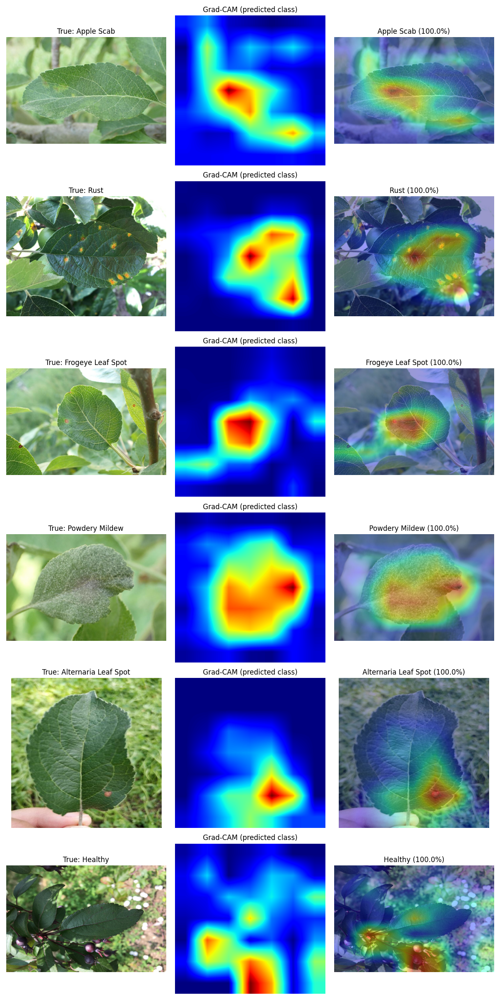

# Apple Disease Detection from Apple Leaf Images

A reproducible, interview-focused rebuild of an **NIT internship project**: classify an apple leaf into five diseases plus Healthy, compare three understandable CNN architectures, and inspect predictions using Grad-CAM.

**Selected model: resnet50_finetuned.** Held-out test accuracy **97.07%**, macro F1 **0.9627**, on **2,013 images**. Selection used validation macro F1 before test evaluation. These are measured results from one seeded run, not a claim of state of the art or field readiness.

## Internship work and motivation

Nine original notebooks were recovered from the supplied Google Drive folder and preserved without modification in `original_work/Apple disease detection codes/`. Stored outputs confirm a historical four-class split of 307 training, 75 validation and 120 test images. The audit distinguishes genuine test results from validation maxima and documents preprocessing, augmentation and reporting limitations. No standalone legacy dataset or model checkpoint was present in that folder.

See [the historical comparison](docs/legacy_experiments.md) and [recovery checksums](docs/original_manifest.json). The upgrade improves methodology, data provenance, evaluation and deployable inference. Old and new accuracies are not directly comparable because both the classes and dataset changed.

## Dataset and classes

Dataset: **[official AppleLeaf9](https://github.com/JasonYangCode/AppleLeaf9)**. License: **CC BY 4.0**. Citation: Yang, Qing; Duan, Shukai; Wang, Lidan (2022), *Efficient Identification of Apple Leaf Diseases in the Wild Using Convolutional Neural Networks*, Agronomy 12(11), 2784. [Paper](https://doi.org/10.3390/agronomy12112784).

The source contains **14,582 images**. This project selected **13,461** images from the requested six classes, quarantined **56** images in near-duplicate groups with conflicting labels, and used **13,405** images. Brown spot, Grey spot and Mosaic are excluded to keep the five-disease-plus-healthy scope. No fallback dataset was needed. Full provenance and audit details are in [data/README.md](data/README.md) and [dataset_audit.json](results/dataset_audit.json).

| Class / checkpoint index order | Used images | Train | Validation | Test |
|---|---:|---:|---:|---:|
| Apple Scab | 5,382 | 3,766 | 808 | 808 |
| Rust | 2,725 | 1,907 | 409 | 409 |
| Frogeye Leaf Spot | 3,181 | 2,226 | 478 | 477 |
| Powdery Mildew | 1,184 | 828 | 178 | 178 |
| Alternaria Leaf Spot | 417 | 291 | 63 | 63 |
| Healthy | 516 | 360 | 78 | 78 |
| **Total** | **13,405** | **9,378** | **2,014** | **2,013** |

Class indices are the row order above, starting at zero. Health → Healthy and Scab → Apple Scab are display-name mappings, not new labels. Source images and processed symlinks are excluded from Git.

### Audit, split and preprocessing

- All selected images decoded successfully. Exact byte hashes and decoded-pixel hashes found no identical files/pixels; perceptual checks found related scenes and contradictory labels.
- Rotation/reflection-aware perceptual-hash groups remain within one split. Seed **42** assigns groups per class to approximately **70/15/15**. Exact membership is saved in [split_manifest.csv](results/split_manifest.csv).
- Split source images **before** training augmentation. EXIF orientation → RGB → resize 224×224 → tensor → ImageNet RGB mean/std normalization, reused for validation, test and upload inference.
- Training only: horizontal flip, ±12° rotation, small translation/zoom and mild brightness/contrast jitter.
- Training class weights are derived only from training frequencies; validation/test reporting is unweighted. We select by macro F1 because minority diseases matter.
- Disk-backed DataLoader with batching, pinned memory and 8 workers; no full-dataset RAM cache.



## Models and transfer learning

**Custom CNN:** four convolutional blocks (32/64/128/192 channels), batch normalization, ReLU, max pooling and dropout. Global average pooling keeps the six-class head small: **316,198 parameters**. Logits enter CrossEntropyLoss; softmax is used for inference.

**MobileNetV2:** official torchvision ImageNet V1 weights, depthwise separable filtering and inverted residual blocks. It provides a lightweight deployment comparison.

**ResNet50:** official torchvision ImageNet V2 weights and residual/skip connections. It provides a well-known larger comparison.

Transfer learning has two phases: freeze the backbone and train the new head, then unfreeze later MobileNet blocks or ResNet layer4 using a much smaller learning rate. Pretrained batch-normalization statistics stay fixed. Adam uses 0.001 for baseline/head training and 0.00003 for fine-tuning. Early stopping and best-checkpoint saving monitor validation macro F1; ReduceLROnPlateau monitors validation loss. Maximum epoch budgets are 15 baseline, 8 frozen and 12 fine-tuning.

All five experiments trained with **PyTorch CUDA on an H100 40 GB MIG allocation**, using FP32 and batch size 64. The tested environment and exact installed versions are recorded in [environment.json](docs/environment.json) and [package_versions.json](docs/package_versions.json).

## Measured comparison

Training accuracy below is the full augmented training epoch associated with each saved validation checkpoint. It includes dropout and differs from deterministic post-training evaluation.

| Experiment | Train accuracy at selected epoch | Validation accuracy | Validation macro F1 | Parameters | Checkpoint MB |
|---|---:|---:|---:|---:|---:|
| custom_cnn | 62.67% | 72.00% | 0.6592 | 316,198 | 1.28 |
| mobilenetv2_frozen | 78.52% | 78.20% | 0.7387 | 2,231,558 | 9.17 |
| mobilenetv2_finetuned | 96.02% | 94.34% | 0.9252 | 2,231,558 | 9.18 |
| resnet50_frozen | 81.97% | 81.53% | 0.8021 | 23,520,326 | 94.40 |
| resnet50_finetuned | 98.68% | 96.52% | 0.9593 | 23,520,326 | 94.40 |

Source: [model_comparison.csv](results/model_comparison.csv), saved phase histories and summaries. Best validation macro F1 selected **resnet50_finetuned**; the tie breaker is lower validation loss. The checkpoint's SHA-256 was saved before test evaluation. Only the selected final model was tested; other candidates have no claimed test results.

### Selected model evaluation

These are deterministic, unaugmented metrics. Train metrics describe fit, validation metrics support selection, and test metrics estimate held-out performance.

| Split | Images | Accuracy | Macro precision | Macro recall | Macro F1 | Weighted F1 |
|---|---:|---:|---:|---:|---:|---:|
| Train | 9,378 | 99.29% | 0.9880 | 0.9964 | 0.9921 | 0.9929 |
| Validation | 2,014 | 96.52% | 0.9502 | 0.9689 | 0.9593 | 0.9653 |
| Test | 2,013 | 97.07% | 0.9617 | 0.9641 | 0.9627 | 0.9707 |

[Complete metrics and per-class scores](results/metrics.json) · [Test predictions](results/test_predictions.csv)





The most frequent confused pair is **Apple Scab ↔ Frogeye Leaf Spot**, with **18** bidirectional test errors. See [error analysis](docs/error_analysis.md) for image-based observations, confidently wrong predictions and uncertainty examples. No model changes were made based on these test errors.

Checkpoint size: **94.40 MB**. Warm batch-one forward median: **2.83 ms**; preprocess-plus-forward median: **6.53 ms**, measured on the recorded GPU. File decoding, model loading, uploads and Grad-CAM are excluded; these are not phone or end-to-end application latency measurements.

## Grad-CAM and demo

Grad-CAM weights final convolutional feature maps using gradients of the predicted class logit. It visualizes regions associated with the prediction for inspection of lesions and background shortcuts. It is a coarse explanation, not a lesion segmentation or proof of biological correctness.



`app.py` accepts an uploaded leaf photograph and shows the image, predicted disease, confidence, all ranked class probabilities and an optional Grad-CAM overlay. Confidence below 0.6 displays: “Prediction confidence is low. Try a clearer image of a single apple leaf.” The demo provides no pesticide recommendations.

## Project architecture

```text
.
├── original_work/       # Nine unchanged internship notebooks
├── notebooks/           # Four lightweight teaching notebooks
├── src/                 # Data, models, training, evaluation, inference, Grad-CAM
├── configs/config.yaml  # Class order, seed, preprocessing and training settings
├── scripts/             # Download, prepare, audit and documentation helpers
├── data/                # Attribution; ignored raw images and processed split
├── models/              # Selected model metadata; ignored binary checkpoints
├── results/             # Measured JSON/CSV, split membership and figures
├── docs/                # Historical audit, methodology and interview notes
├── tests/               # Dataset-independent contract/smoke tests
└── app.py               # Streamlit demo
```

No redundant legacy notebook copies are created. The notebooks call/read reusable modules and measured artifacts; expensive training cells are disabled by default.

## Installation and quick demo

Python 3.10 was tested. Keep an existing working CUDA-enabled torch/torchvision pair in a GPU notebook. A fresh environment needs a compatible PyTorch/torchvision installation; see [official installation instructions](https://pytorch.org/get-started/locally/). No system CUDA upgrade is part of this project.

```bash
git clone https://github.com/Tanishgupta28/apple-disease-detection.git
cd apple-disease-detection
python -m pip install -r requirements.txt
python scripts/download_model.py
streamlit run app.py
```

The selected checkpoint is a checksummed [GitHub release asset](https://github.com/Tanishgupta28/apple-disease-detection/releases/tag/v1.0.0), rather than a large Git blob. `download_model.py` verifies it against `models/selected_model.json`. Public release downloading needs no GitHub login. In the current project directory, the checkpoint is already present, so launch directly with `streamlit run app.py`.

## Reproduce preparation, training and evaluation

Run commands from the project root:

```bash
python scripts/download_dataset.py
python scripts/prepare_data.py
CUBLAS_WORKSPACE_CONFIG=:4096:8 python -m src.train --run-dir runs/reproduction
python -m src.evaluate --run-dir runs/reproduction
python -m src.predict /path/to/apple_leaf.jpg
python -m pytest
```

Preparation refuses to overwrite an existing split. Training defaults to all three architectures and five experiments, requires a visible CUDA device, and refuses to overwrite a benchmark with published test metrics. Evaluation reuses existing frozen metrics. For a deliberately new benchmark, preserve these artifacts and explicitly establish a new experiment workspace/configuration; do not mix a new model/split with this report. The commands above are the fresh benchmark sequence, not a reason to rerun the completed results in place.

The `--run-dir` option stores new checkpoints/results under `runs/reproduction/` inside this project root, preserving the published benchmark. Run preparation only when the processed manifest is absent; the committed split manifest records the benchmark to reproduce. A repeated run follows the fixed protocol; it does not justify choosing a new model from the published test scores.

Individual model training in an untested run:

```bash
python -m src.train --model custom_cnn --run-dir runs/new_run
python -m src.train --model mobilenetv2 --run-dir runs/new_run
python -m src.train --model resnet50 --run-dir runs/new_run
```

Inference reconstructs the selected architecture, loads its weights and reads class order/image size from checkpoint metadata. No ImageNet download is needed at inference. Dataset-independent tests use no training images and no pretrained downloads.

## Limitations and future work

- One seed and bounded epoch budgets; no multi-seed intervals or broad hyperparameter search.
- No independent orchard/season test. Perceptual grouping reduces known duplicate leakage but cannot establish all related leaves or source augmentation identities.
- Single-label six-class scope excludes other diseases and mixed diagnoses. Unknown/non-leaf uploads can receive high confidence.
- Resizing may distort shape or obscure small lesions; source labels may be imperfect.
- Softmax probabilities are uncalibrated; Grad-CAM is approximate.
- GPU timing is not mobile deployment timing. External validation is required before practical field claims.

Priorities: expert-reviewed labels/group metadata, independent orchard testing, validation-based calibration, unknown-image rejection, class-weight ablation, multi-seed runs and actual target-device measurements. The focus remains correct methodology and understandable models.

## Interview preparation

Start with [interview_notes.md](docs/interview_notes.md) for simple explanations, spoken interview answers and 40 project questions. Then read [methodology.md](docs/methodology.md), `src/models.py`, `src/train.py`, the results table, and the legacy audit. Be able to explain why validation and test are separate and why an architecture name does not guarantee better results.

## References and licenses

- [AppleLeaf9 official source and CC BY 4.0 license](https://github.com/JasonYangCode/AppleLeaf9)
- [Yang, Duan & Wang, Agronomy 2022](https://doi.org/10.3390/agronomy12112784)
- [MobileNetV2 paper](https://arxiv.org/abs/1801.04381)
- [ResNet paper](https://arxiv.org/abs/1512.03385)
- [Grad-CAM paper](https://arxiv.org/abs/1610.02391)
- [Torchvision model documentation](https://pytorch.org/vision/stable/models.html)

Project code is MIT licensed. Dataset/sample-image rights remain with their original authors under the dataset license. This repository's sample/error/Grad-CAM figures are derived from AppleLeaf9 with attribution above.
